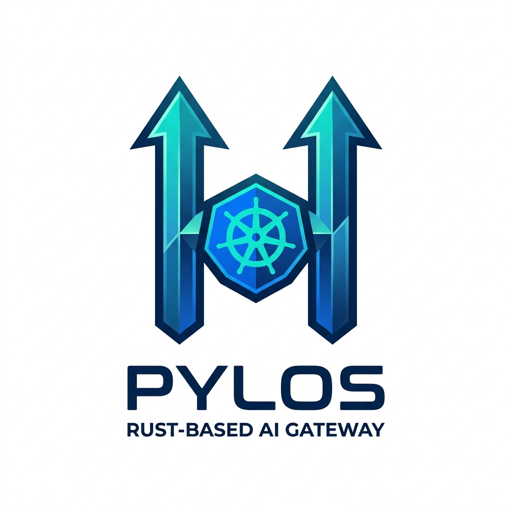

# Pylos - Rust LLM Gateway



Pylos is a high-performance, ultra-low latency AI gateway and MCP proxy rewritten in Rust, inspired by the Bifrost architecture.

## 🚀 Key Features

- **Unified AI Gateway**: Single API for 20+ LLM providers.
- **OpenAI Compatible**: Drop-in replacement for OpenAI SDKs.
- **MCP Integration**: Connect your agents to any MCP-compliant tool.
- **Modern Architecture**: Hexagonal design with modular crates.
- **Validation Pipeline**: Robust CI/CD with security audits and linting.

## 🏗️ Architecture

Pylos follows a hexagonal architecture pattern:

- `pylos-core`: Domain entities and core logic.
- `pylos-application`: Use cases and orchestration.
- `pylos-infrastructure`: Provider adapters and persistence.
- `pylos-server`: Axum-based HTTP/WS server.

## 🛠️ Development

### Setup
```bash
make setup
```

### Run
```bash
make run
```

### Test & Lint
```bash
make all
```

## 🛡️ Security
Security audits and dependency checks are integrated into the CI pipeline. Use `make audit` and `make deny` for local checks.

## 📄 License
TBD